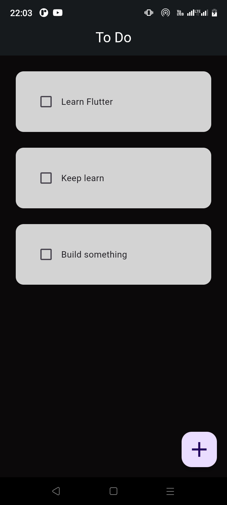
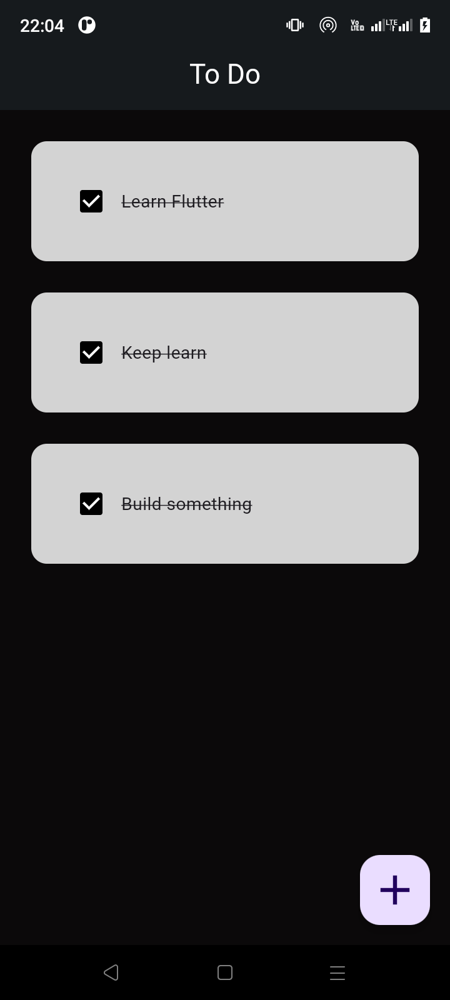
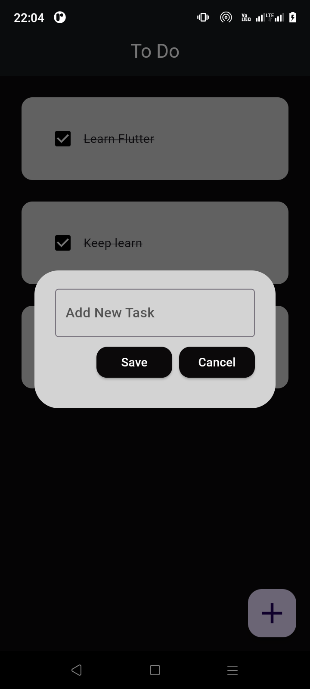
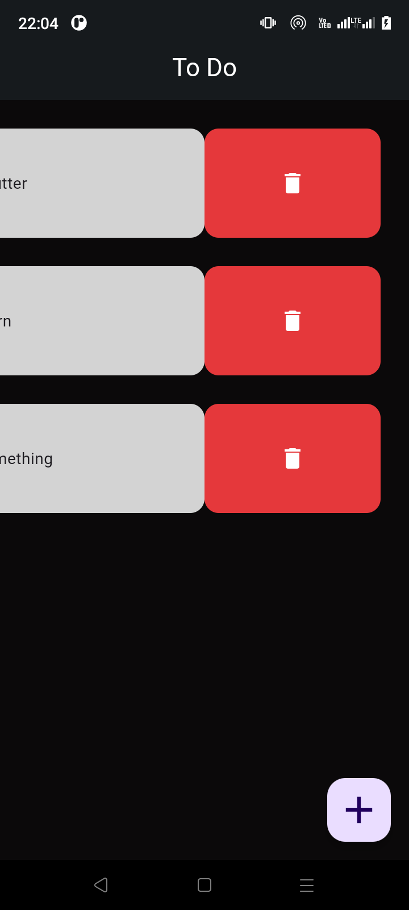

# To Do App

A new Flutter project.

## Credits

This project was created following a tutorial by mitchkoko. You can find the original tutorial [here](https://youtu.be/mMgr47QBZWA?si=l6wzrtmi7G78DNaE).
